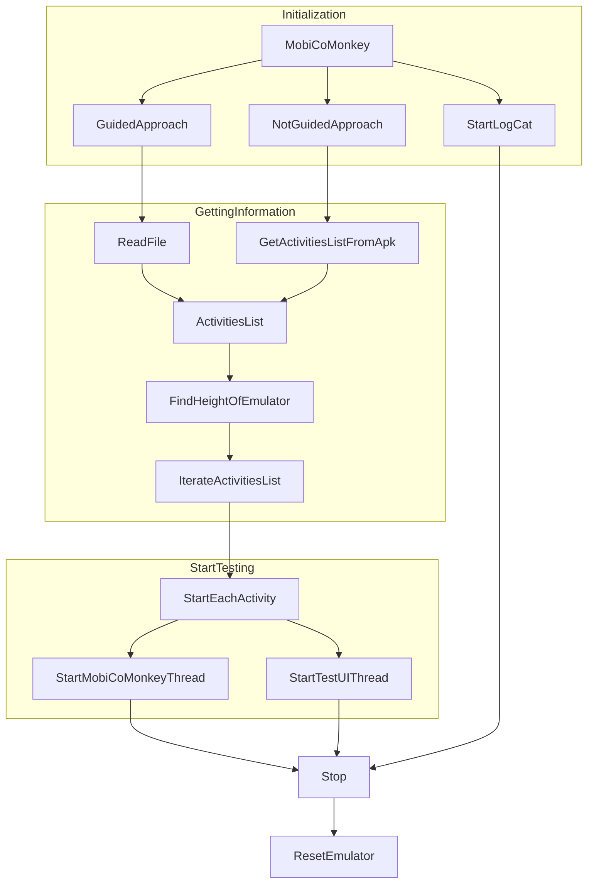

```mermaid
graph TD;
    mcm[MobiCoMonkey]
    subgraph Initialization
    mcm --> StartLogCat
    mcm --> GuidedApproach
    mcm --> NotGuidedApproach
    end
    subgraph GettingInformation
    GuidedApproach --> ReadFile
    ReadFile --> ActivitiesList
    NotGuidedApproach --> GetActivitiesListFromApk
    GetActivitiesListFromApk --> ActivitiesList
    ActivitiesList --> FindHeightOfEmulator
    FindHeightOfEmulator --> IterateActivitiesList
    end
    subgraph StartTesting
    IterateActivitiesList --> StartEachActivity
    StartEachActivity --> StartMobiCoMonkeyThread
    StartEachActivity --> StartTestUIThread
    end
    StartMobiCoMonkeyThread --> Stop
    StartTestUIThread --> Stop

    StartLogCat --> Stop

    Stop --> ResetEmulator
```